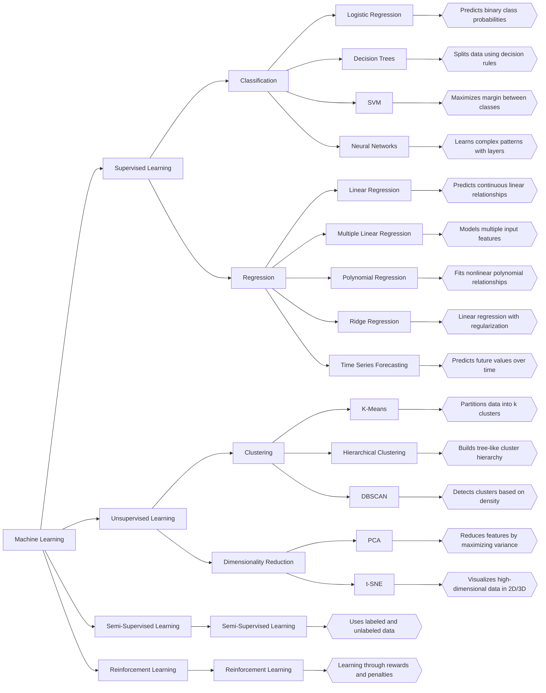
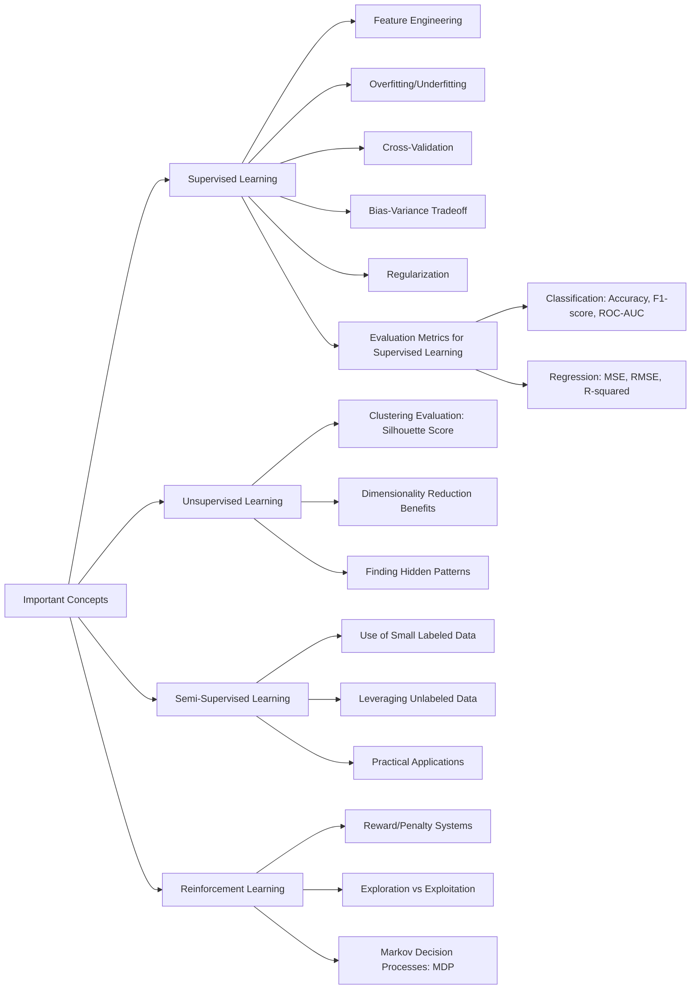

```mermaid
graph LR;
    A[Machine Learning] --> B[Supervised Learning]
    A --> C[Unsupervised Learning]
    A --> D[Semi-Supervised Learning]
    A --> E[Reinforcement Learning]
    
    %% Supervised Learning
    B --> B1[Classification]
    B --> B2[Regression]
    
    %% Unsupervised Learning
    C --> C1[Clustering]
    C --> C2[Dimensionality Reduction]
    
    %% Classification Algorithms
    B1 --> B1A[Logistic Regression]
    B1A --> B1A_EXP{{"Predicts binary class probabilities"}}

    B1 --> B1B[Decision Trees]
    B1B --> B1B_EXP{{"Splits data using decision rules"}}

    B1 --> B1C[SVM]
    B1C --> B1C_EXP{{"Maximizes margin between classes"}}

    B1 --> B1D[Neural Networks]
    B1D --> B1D_EXP{{"Learns complex patterns with layers"}}
    
    %% Regression Algorithms
    B2 --> B2A[Linear Regression]
    B2A --> B2A_EXP{{"Predicts continuous linear relationships"}}

    B2 --> B2B[Multiple Linear Regression]
    B2B --> B2B_EXP{{"Models multiple input features"}}

    B2 --> B2C[Polynomial Regression]
    B2C --> B2C_EXP{{"Fits nonlinear polynomial relationships"}}

    B2 --> B2D[Ridge Regression]
    B2D --> B2D_EXP{{"Linear regression with regularization"}}

    B2 --> B2E[Time Series Forecasting]
    B2E --> B2E_EXP{{"Predicts future values over time"}}
    
    %% Clustering Algorithms
    C1 --> C1A[K-Means]
    C1A --> C1A_EXP{{"Partitions data into k clusters"}}

    C1 --> C1B[Hierarchical Clustering]
    C1B --> C1B_EXP{{"Builds tree-like cluster hierarchy"}}

    C1 --> C1C[DBSCAN]
    C1C --> C1C_EXP{{"Detects clusters based on density"}}
    
    %% Dimensionality Reduction Techniques
    C2 --> C2A[PCA]
    C2A --> C2A_EXP{{"Reduces features by maximizing variance"}}

    C2 --> C2B[t-SNE]
    C2B --> C2B_EXP{{"Visualizes high-dimensional data in 2D/3D"}}
    
    %% Semi-Supervised Learning
    D --> D1[Semi-Supervised Learning]
    D1 --> D1_EXP{{"Uses labeled and unlabeled data"}}
    
    %% Reinforcement Learning
    E --> E1[Reinforcement Learning]
    E1 --> E1_EXP{{"Learning through rewards and penalties"}}


```
* Despite its name, logistic regression is used for binary classification or multi-class classification problems, not for regression tasks.

```mermaid
graph LR;
    F[Important Concepts] --> F1[Supervised Learning]
    F1 --> F1A[Feature Engineering]
    F1 --> F1B[Overfitting/Underfitting]
    F1 --> F1C[Cross-Validation]
    F1 --> F1D[Bias-Variance Tradeoff]
    F1 --> F1E[Regularization]

    F --> F2[Unsupervised Learning]
    F2 --> F2A[Clustering Evaluation: Silhouette Score]
    F2 --> F2B[Dimensionality Reduction Benefits]
    F2 --> F2C[Finding Hidden Patterns]
    
    F --> F3[Semi-Supervised Learning]
    F3 --> F3A[Use of Small Labeled Data]
    F3 --> F3B[Leveraging Unlabeled Data]
    F3 --> F3C[Practical Applications]

    F --> F4[Reinforcement Learning]
    F4 --> F4A[Reward/Penalty Systems]
    F4 --> F4B[Exploration vs Exploitation]
    F4 --> F4C[Markov Decision Processes: MDP]

    %% Evaluation Metrics as a sub-branch of Supervised Learning
    F1 --> G[Evaluation Metrics for Supervised Learning]
    G --> G1[Classification: Accuracy, F1-score, ROC-AUC]
    G --> G2[Regression: MSE, RMSE, R-squared]

```

