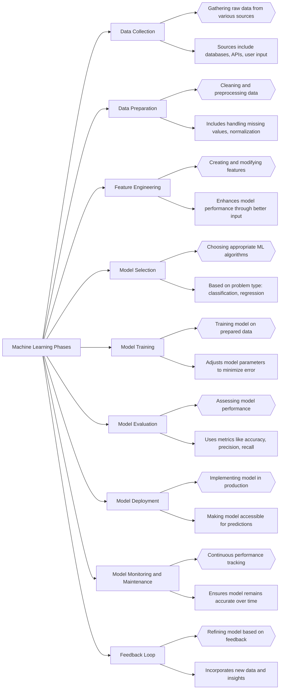

```mermaid
graph LR;
    A[Machine Learning Phases] --> B[Data Collection]
    B --> B_EXP{{"Gathering raw data from various sources"}}
    B --> B_NOTE["Sources include databases, APIs, user input"]

    A --> C[Data Preparation]
    C --> C_EXP{{"Cleaning and preprocessing data"}}
    C --> C_NOTE["Includes handling missing values, normalization"]

    A --> D[Feature Engineering]
    D --> D_EXP{{"Creating and modifying features"}}
    D --> D_NOTE["Enhances model performance through better input"]

    A --> E[Model Selection]
    E --> E_EXP{{"Choosing appropriate ML algorithms"}}
    E --> E_NOTE["Based on problem type: classification, regression"]

    A --> F[Model Training]
    F --> F_EXP{{"Training model on prepared data"}}
    F --> F_NOTE["Adjusts model parameters to minimize error"]

    A --> G[Model Evaluation]
    G --> G_EXP{{"Assessing model performance"}}
    G --> G_NOTE["Uses metrics like accuracy, precision, recall"]

    A --> H[Model Deployment]
    H --> H_EXP{{"Implementing model in production"}}
    H --> H_NOTE["Making model accessible for predictions"]

    A --> I[Model Monitoring and Maintenance]
    I --> I_EXP{{"Continuous performance tracking"}}
    I --> I_NOTE["Ensures model remains accurate over time"]

    A --> J[Feedback Loop]
    J --> J_EXP{{"Refining model based on feedback"}}
    J --> J_NOTE["Incorporates new data and insights"]
```
