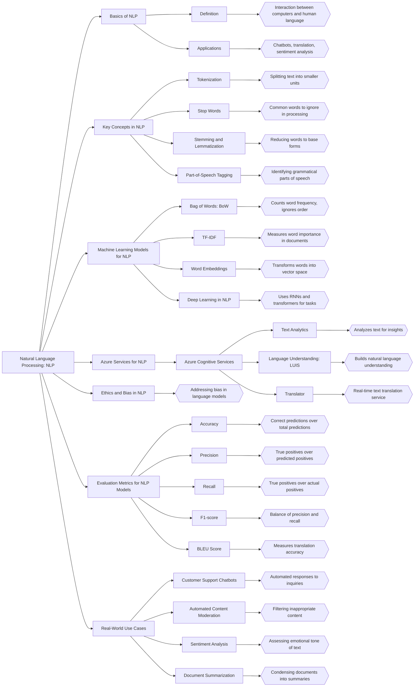

```mermaid
graph LR;
    A[Natural Language Processing: NLP] --> B[Basics of NLP]
    B --> B1[Definition]
    B1 --> B1_EXP{{"Interaction between computers and human language"}}
    
    B --> B2[Applications]
    B2 --> B2_EXP{{"Chatbots, translation, sentiment analysis"}}

    A --> C[Key Concepts in NLP]
    C --> C1[Tokenization]
    C1 --> C1_EXP{{"Splitting text into smaller units"}}

    C --> C2[Stop Words]
    C2 --> C2_EXP{{"Common words to ignore in processing"}}

    C --> C3[Stemming and Lemmatization]
    C3 --> C3_EXP{{"Reducing words to base forms"}}

    C --> C4[Part-of-Speech Tagging]
    C4 --> C4_EXP{{"Identifying grammatical parts of speech"}}

    A --> D[Machine Learning Models for NLP]
    D --> D1[Bag of Words: BoW]
    D1 --> D1_EXP{{"Counts word frequency, ignores order"}}

    D --> D2[TF-IDF]
    D2 --> D2_EXP{{"Measures word importance in documents"}}

    D --> D3[Word Embeddings]
    D3 --> D3_EXP{{"Transforms words into vector space"}}

    D --> D4[Deep Learning in NLP]
    D4 --> D4_EXP{{"Uses RNNs and transformers for tasks"}}

    A --> E[Azure Services for NLP]
    E --> E1[Azure Cognitive Services]
    
    E1 --> E1A[Text Analytics]
    E1A --> E1A_EXP{{"Analyzes text for insights"}}

    E1 --> E1B[Language Understanding: LUIS]
    E1B --> E1B_EXP{{"Builds natural language understanding"}}

    E1 --> E1C[Translator]
    E1C --> E1C_EXP{{"Real-time text translation service"}}

    A --> F[Ethics and Bias in NLP]
    F --> F_EXP{{"Addressing bias in language models"}}

    A --> G[Evaluation Metrics for NLP Models]
    G --> G1[Accuracy]
    G1 --> G1_EXP{{"Correct predictions over total predictions"}}

    G --> G2[Precision]
    G2 --> G2_EXP{{"True positives over predicted positives"}}

    G --> G3[Recall]
    G3 --> G3_EXP{{"True positives over actual positives"}}

    G --> G4[F1-score]
    G4 --> G4_EXP{{"Balance of precision and recall"}}

    G --> G5[BLEU Score]
    G5 --> G5_EXP{{"Measures translation accuracy"}}

    A --> H[Real-World Use Cases]
    H --> H1[Customer Support Chatbots]
    H1 --> H1_EXP{{"Automated responses to inquiries"}}

    H --> H2[Automated Content Moderation]
    H2 --> H2_EXP{{"Filtering inappropriate content"}}

    H --> H3[Sentiment Analysis]
    H3 --> H3_EXP{{"Assessing emotional tone of text"}}

    H --> H4[Document Summarization]
    H4 --> H4_EXP{{"Condensing documents into summaries"}}
```
