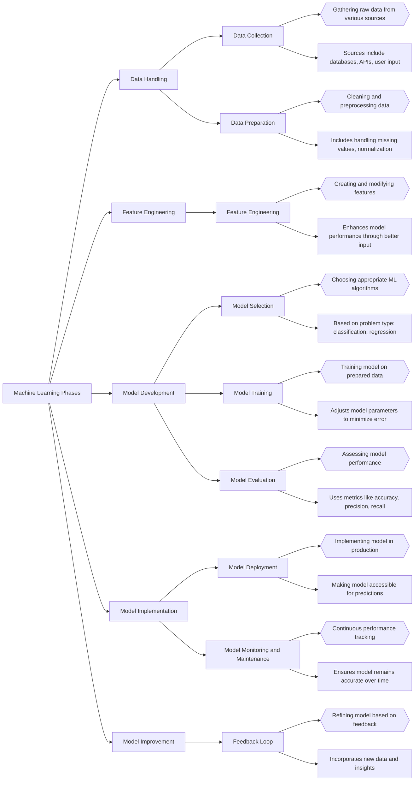

```mermaid
graph LR;
    A[Machine Learning Phases] --> B[Data Handling]
    B --> B1[Data Collection]
    B1 --> B_EXP{{"Gathering raw data from various sources"}}
    B1 --> B_NOTE["Sources include databases, APIs, user input"]

    B --> B2[Data Preparation]
    B2 --> B2_EXP{{"Cleaning and preprocessing data"}}
    B2 --> B2_NOTE["Includes handling missing values, normalization"]

    A --> C[Feature Engineering]
    C --> C1[Feature Engineering]
    C1 --> C1_EXP{{"Creating and modifying features"}}
    C1 --> C1_NOTE["Enhances model performance through better input"]

    A --> D[Model Development]
    D --> D1[Model Selection]
    D1 --> D1_EXP{{"Choosing appropriate ML algorithms"}}
    D1 --> D1_NOTE["Based on problem type: classification, regression"]

    D --> D2[Model Training]
    D2 --> D2_EXP{{"Training model on prepared data"}}
    D2 --> D2_NOTE["Adjusts model parameters to minimize error"]

    D --> D3[Model Evaluation]
    D3 --> D3_EXP{{"Assessing model performance"}}
    D3 --> D3_NOTE["Uses metrics like accuracy, precision, recall"]

    A --> E[Model Implementation]
    E --> E1[Model Deployment]
    E1 --> E1_EXP{{"Implementing model in production"}}
    E1 --> E1_NOTE["Making model accessible for predictions"]

    E --> E2[Model Monitoring and Maintenance]
    E2 --> E2_EXP{{"Continuous performance tracking"}}
    E2 --> E2_NOTE["Ensures model remains accurate over time"]

    A --> F[Model Improvement]
    F --> F1[Feedback Loop]
    F1 --> F1_EXP{{"Refining model based on feedback"}}
    F1 --> F1_NOTE["Incorporates new data and insights"]

```
